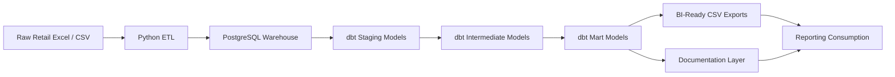
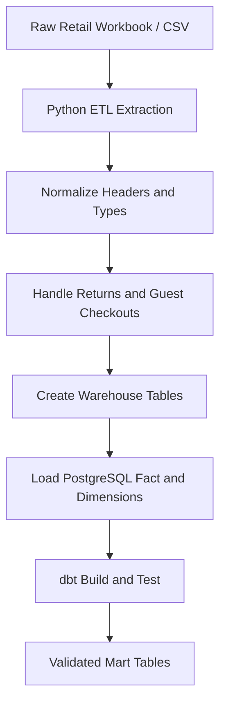
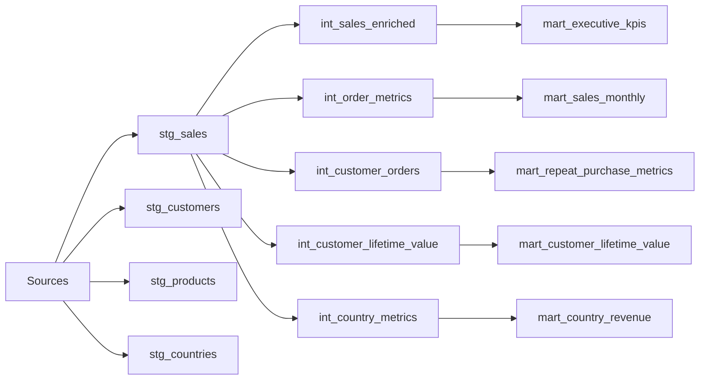
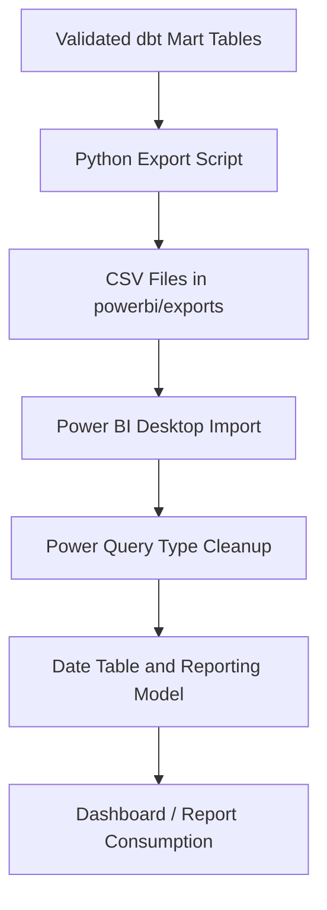
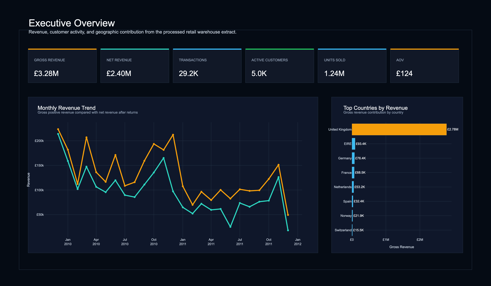
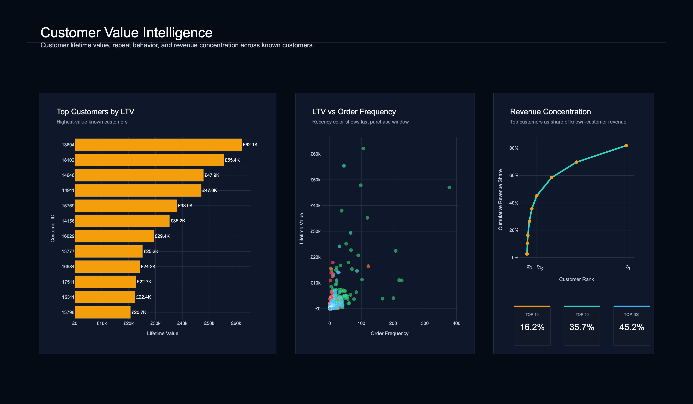
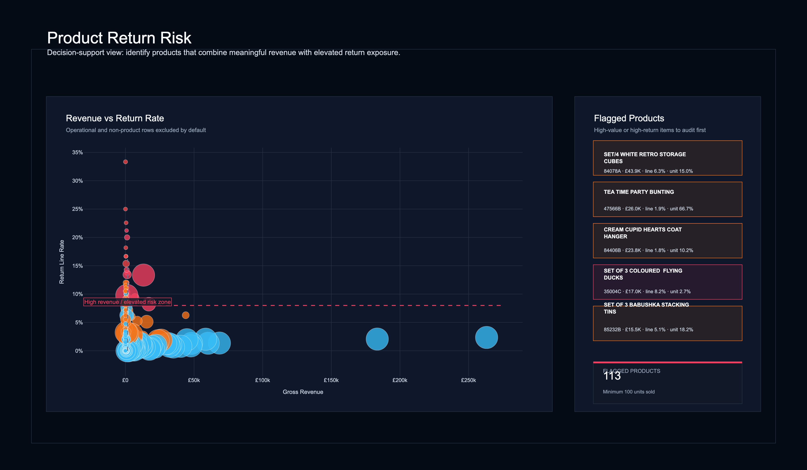

# Customer Intelligence Data Warehouse

A reproducible analytics engineering and BI-ready warehouse project built around Online Retail II-style e-commerce transaction data. The repository combines Python ETL, PostgreSQL, dbt staging/intermediate/mart models, and Power BI-ready documentation to convert raw retail transactions into trusted reporting tables and business metrics.

---

## Project Overview

Customer Intelligence Data Warehouse ingests raw retail transaction data, cleans and structures it in PostgreSQL, and transforms it through dbt into a layered analytics model. The final marts support executive KPI reporting, customer lifetime value analysis, repeat purchase analysis, country revenue analysis, and monthly sales trend reporting.

The main delivery is the warehouse and analytics engineering stack: Python ETL, PostgreSQL, dbt, validated marts, and BI-ready exports. Plotly Dash and reporting assets are included as secondary visualization artifacts.

---

## Why This Project Matters

Retail transaction data is rarely dashboard-ready. It often includes inconsistent fields, returns, missing customer identifiers, mixed grains, and source noise that make direct analysis unreliable.

This project addresses that problem by separating ingestion, cleaning, modeling, and reporting logic. The result is a documented warehouse workflow that produces stable marts for analysis and export, with clear validation and a transparent modeling layer.

---

## Architecture



The pipeline starts with raw retail files, processes them through Python ETL, loads the warehouse into PostgreSQL, and then applies dbt to create reusable analytical layers. The mart layer is the main consumption layer for KPI reporting and export workflows.

---

## Dataset and Scope

The project is built around Online Retail II-style transaction data and modeled for customer and revenue analysis.

### Implemented warehouse concepts
- Invoices and invoice numbers for order-level analysis.
- Customers for customer-level KPIs and repeat purchase metrics.
- Products identified by stock code and product description.
- Countries for geographic reporting.
- Transaction line facts with quantity, invoice date, unit price, and return flag.

### Known reporting metrics
- Average order value.
- Repeat purchase rate.
- Customer lifetime value.
- Country revenue.
- Monthly revenue trends.
- Quantity sold.
- Total revenue.
- Total customers.
- Total invoices.

---

## Data Pipeline



The Python ETL pipeline extracts raw transaction data, normalizes fields, converts types, flags returns, and loads warehouse tables. dbt then validates and transforms the warehouse into staging, intermediate, and mart outputs.

---

## dbt Model Lineage



Staging models standardize the source data. Intermediate models encode reusable business logic. Mart models expose stable BI-ready tables that can be consumed directly or exported to CSV for reporting workflows.

---

## Key Marts

### `mart_executive_kpis`
Executive summary table for total revenue, total customers, total invoices, average order value, repeat purchase rate, and quantity sold.

### `mart_customer_lifetime_value`
Customer-level revenue ranking for value analysis and prioritization.

### `mart_repeat_purchase_metrics`
Repeat purchase behavior and loyalty-oriented metrics.

### `mart_country_revenue`
Country-level revenue, order count, customer count, and average order value.

### `mart_sales_monthly`
Monthly revenue trend table for time-series reporting.

---

## Validation Results

The dbt implementation is validated and documented.

- 14 dbt models built successfully.
- 41 dbt tests passed.
- dbt documentation generated successfully.
- dbt artifacts available under `target/`.

### Test coverage includes
- `not_null`
- `unique`
- `relationships`
- `accepted_values`

This gives the warehouse a documented, tested analytics layer rather than a collection of standalone SQL files.

---

## BI / Export Flow



The repository includes Power BI-ready documentation and a CSV export workflow for the mart layer. The project should be described as Power BI-ready and PL-300-aligned, not as a completed Power BI workbook.

### BI documentation included
- DAX measure definitions.
- Power Query import steps.
- Export workflow documentation.
- Data model guidance for mart consumption.

### Scope note
A `.pbix` file, Power BI screenshots, and Power BI publishing artifacts are not included yet.

---

## Dashboarding / Visualization Artifacts

Plotly Dash and report assets are included as secondary visualization artifacts. They support the portfolio narrative, but they are not the core product.

### Dashboard / report visuals






---

## Repository Structure

```text
Customer Intelligence Data Warehouse/
├── config/
│   └── config.yaml
├── data/
│   ├── processed/
│   └── raw/
│       ├── zips/
│       └── processed/
├── dashboard/
├── dashboards/
│   └── powerbi_requirements.md
├── dbt_project.yml
├── docker-compose.yml
├── models/
├── powerbi/
├── reports/
│   └── model_rebuild_report.md
├── src/
│   ├── etl/
│   ├── export_dbt_marts_for_powerbi.py
│   └── pipeline.py
├── target/
└── README.md
```

---

## How to Run

```bash
docker compose up -d
python src/etl/pipeline.py
export DBT_POSTGRES_PASSWORD='your-local-postgres-password'
dbt run
dbt test
dbt docs generate
python src/export_dbt_marts_for_powerbi.py
```

After running the pipeline, the warehouse is available in PostgreSQL, dbt artifacts are generated in `target/`, and the mart CSV exports are written to `powerbi/exports/`.

---

## Technical Skills Demonstrated

- Python ETL for structured warehouse loading.
- PostgreSQL dimensional modeling.
- dbt staging, intermediate, and mart layer design.
- Data quality testing and documentation.
- BI-ready semantic modeling.
- Export workflows for reporting consumption.
- Warehouse-to-reporting separation of logic.

---

## Tech Stack

- Python
- pandas
- SQLAlchemy
- psycopg2
- PostgreSQL
- dbt
- Docker
- SQL
- Power BI-ready documentation
- Plotly Dash