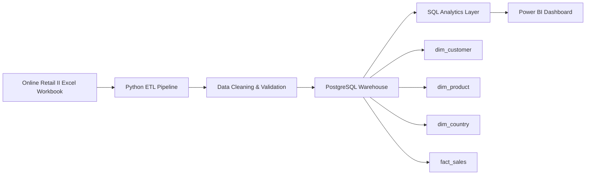
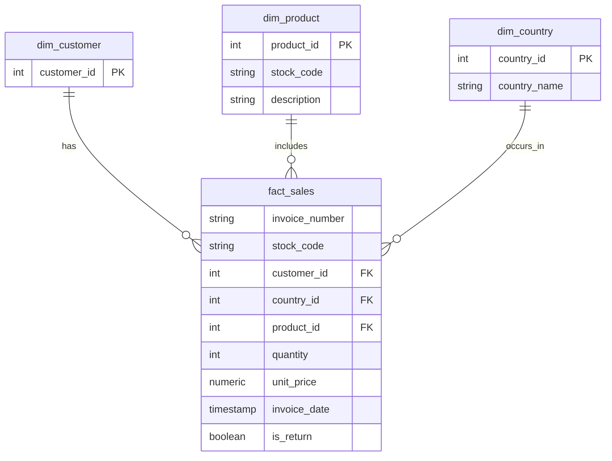
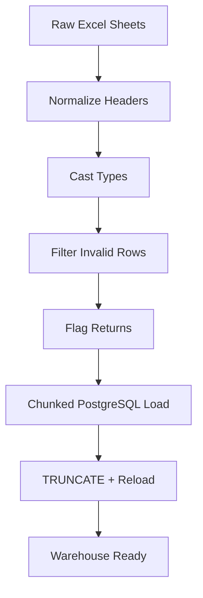
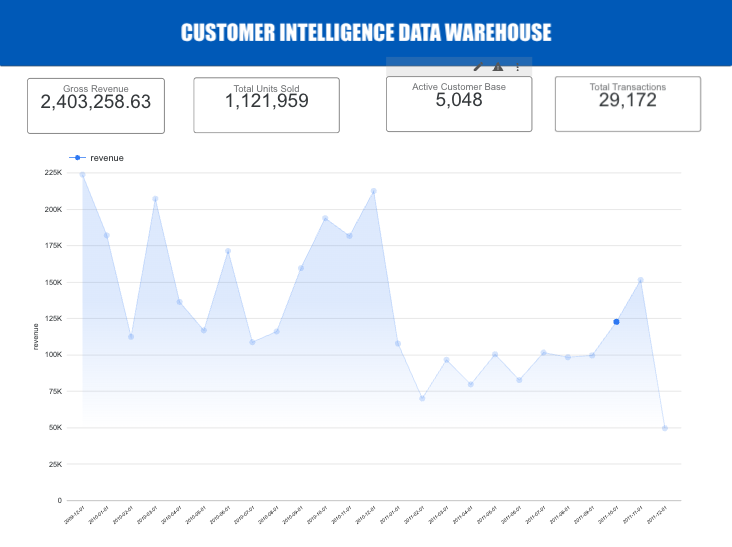
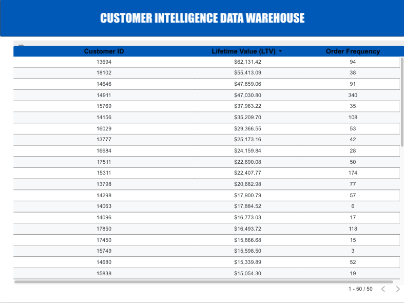
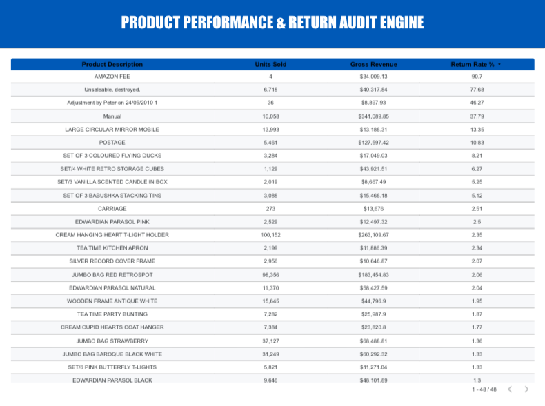
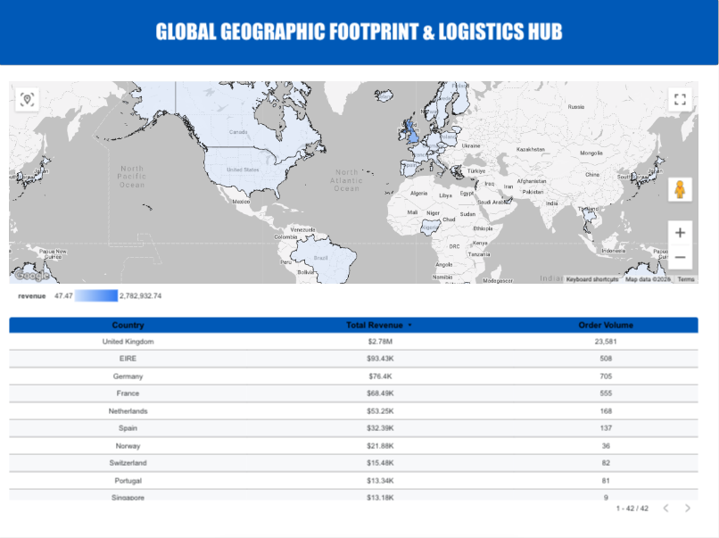

# Customer Intelligence Data Warehouse
ETL, PostgreSQL, Docker, and SQL Analytics for Online Retail II

An end-to-end, production-grade analytics and data warehousing platform that ingests over 1 million raw e-commerce transactions, cleans and structures them into an optimized star schema, and surfaces business-critical financial and customer KPIs.

---

## System Architecture



---

## Business Problem

A UK-based online retailer had two years of transaction history split across multiple workbook sheets with inconsistent column names, mixed data types, guest checkouts, canceled orders, and other transactional noise.

This project builds the data infrastructure from scratch to answer questions like:

- Who are the highest-value customers over their lifetime?
- What is the monthly revenue trend?
- How do return rates behave across transaction categories?
- Which countries are driving the most growth?
- What is the repeat purchase behavior across the customer base?

---

## Dataset Profile

The project uses the **UCI Online Retail II** dataset, a real-world transactional dataset from a UK-based online retailer.

- Raw extracted records: **1,067,371**
- Validated records after cleaning: **1,062,984**
- Time span: **25 months**
- Geographic scope: **43 countries**
- Unique customers: **5,876**
- Unique products: **4,000+**
- Total revenue surfaced: **~£3M+**

---

## Warehouse Design

The data is modeled into a star schema for fast analytical querying.

### Dimension tables

- **dim_customer**: stores unique customers and supports guest checkout rows using NULL keys.
- **dim_product**: stores product metadata and resolves stock code variations.
- **dim_country**: stores normalized country names with surrogate keys.

### Fact table

- **fact_sales**: contains transactional sales records with quantity, unit price, invoice date, and return flags.

---

## Dimensional Model



---

## ETL Pipeline

The pipeline is built in Python using an object-oriented approach and runs end to end through a single orchestrated workflow.

### Extract
- Reads multi-sheet Excel data using `pandas.ExcelFile`.
- Concatenates the workbook sheets into one unified dataframe.

### Transform
- Normalizes column headers with regex-based cleanup.
- Casts dates and numeric fields safely.
- Filters invalid pricing rows.
- Identifies returns using invoice prefixes.
- Handles nullable customer IDs for guest checkout records.

### Load
- Uses an idempotent truncate-and-reload pattern.
- Inserts data into PostgreSQL in chunks of 10,000 rows.
- Uses SQLAlchemy with `psycopg2` for efficient loading.

---

## ETL Flow



---

## SQL Analytics Layer

The warehouse is paired with SQL files that answer business questions directly.

### Core analytics files

- `monthly_revenue.sql` — monthly revenue trend.
- `top_customers.sql` — customer lifetime value ranking.
- `avg_order_value.sql` — average basket value.
- `repeat_purchase_rate.sql` — loyalty and repeat behavior.
- `customer_retention.sql` — monthly cohort retention matrix.

### Example metrics surfaced

- Average order value: **123.57**
- Repeat purchase rate: **67.25%**
- Top customer lifetime value: **62,131.42**
- Monthly revenue tracked across **25 periods**

---

## Sample SQL Outputs

### Average order value
```text
avg_order_value
---------------
123.57
```

### Repeat purchase rate
```text
repeat_purchase_rate_pct
------------------------
67.25
```

### Customer retention cohorts
```text
cohort_month     | cohort_size
------------------+-------------
2009-12-01        | 854
2010-01-01        | 372
...
2011-12-01        | 27
```

### Top customers
```text
customer_id | lifetime_value | total_orders
------------+----------------+-------------
13694       | 62131.42       | 94
18102       | 55413.09       | 38
14646       | 47859.06       | 91
...
```

### Monthly revenue
```text
month      | revenue
-----------+----------
2009-12-01 | 223598.04
2010-01-01 | 181917.61
...
2011-12-01 | 49436.64
```

---

## Tech Stack

- Python
- pandas
- SQLAlchemy
- psycopg2
- PostgreSQL 15-alpine
- Docker
- Docker Compose
- SQL
- Power BI

---

## Repository Structure

```text
customer_intelligence_warehouse/
├── config/
│   └── config.yaml
├── data/
│   ├── raw/
│   │   └── online_retail_II.xlsx
│   └── processed/
├── sql/
│   ├── ddl/
│   │   └── schema.sql
│   └── analytics/
│       ├── monthly_revenue.sql
│       ├── top_customers.sql
│       ├── avg_order_value.sql
│       ├── repeat_purchase_rate.sql
│       └── customer_retention.sql
├── src/
│   └── etl/
│       └── pipeline.py
├── dashboards/
│   └── powerbi_requirements.md
├── docker-compose.yml
├── .gitignore
└── README.md
```

---

## What This Demonstrates

- Idempotent ETL pipelines.
- Dimensional modeling and star schema design.
- SQL analytics for business reporting.
- Handling messy real-world retail data.
- Docker-based local warehouse deployment.
- BI-ready architecture for dashboarding.

---

## How to Run

```bash
git clone <your-repo-url>
cd customer_intelligence_warehouse
docker compose up -d
python src/etl/pipeline.py
```

Run the SQL analytics files with PostgreSQL:

```bash
docker exec -i customer_analytics_postgres psql -U analytics_engineer -d customer_intelligence_db < sql/analytics/avg_order_value.sql
docker exec -i customer_analytics_postgres psql -U analytics_engineer -d customer_intelligence_db < sql/analytics/repeat_purchase_rate.sql
docker exec -i customer_analytics_postgres psql -U analytics_engineer -d customer_intelligence_db < sql/analytics/monthly_revenue.sql
```

## Dashboard Preview
The screenshots below show the four main report pages built from the warehouse.








---

## Project Value

This project turns messy retail transactions into a clean enterprise analytics warehouse with reusable SQL assets, reliable loading, and executive-ready metrics.

It is especially strong for:
- Data Analyst
- Business Analyst
- Analytics Engineer
- Business Intelligence Analyst
- Analytics Associate